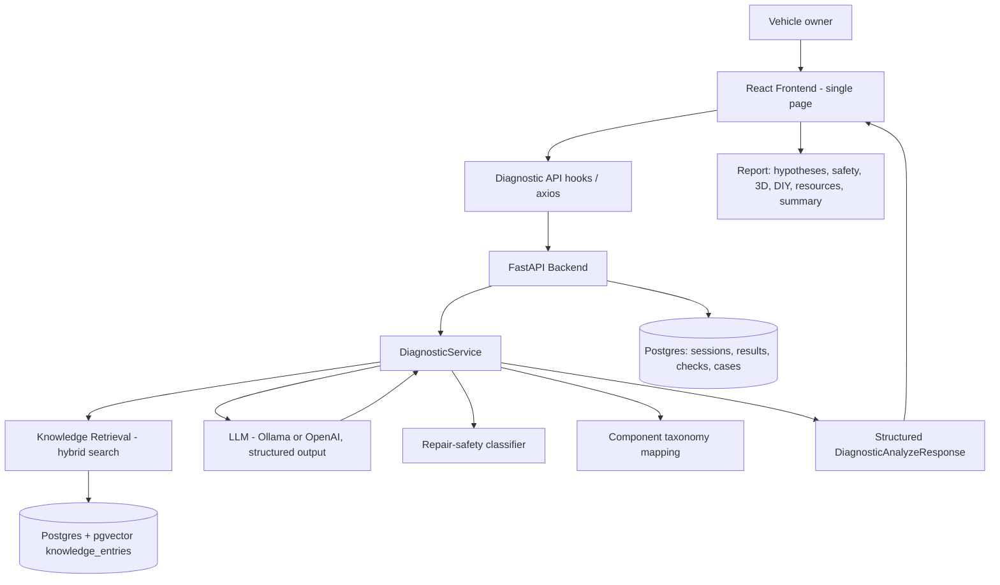

# Automotive Diagnostic AI

An AI-powered automotive diagnostic assistant that turns natural-language vehicle
symptoms into structured, safety-aware diagnostic assessments.

The system is an engineering project that combines natural-language symptom
understanding, retrieval-augmented diagnostic reasoning, structured LLM outputs,
ranked fault hypotheses, evidence-based confidence, adaptive follow-up questioning,
safety classification, repair guidance, semantic knowledge retrieval, an interactive
3D vehicle visualization, and a mechanic-ready report. It is a **decision-support and
diagnostic-assistance system** — not a replacement for a professional mechanic, and
not a thin wrapper around a chat completion API.

---

## Overview

### The problem

A vehicle owner experiences a symptom — a grinding noise while braking, a shake during
acceleration, an engine that stalls at idle — but usually does not know:

- which component or system is involved,
- whether the issue is urgent or can be driven on,
- what to inspect first,
- whether the repair is appropriate for a confident DIYer,
- which tools and parts the job would require,
- or what concrete information to give a mechanic.

Generic "ask an AI" chat interfaces return prose that is hard to act on, easy to
misread, and rarely tied to evidence or safety constraints.

### What this project does

It frames diagnosis as a **structured reasoning problem**:

1. The user describes the symptom in their own words (no automotive jargon required).
2. The backend retrieves relevant automotive knowledge, constructs a constrained
   prompt, and asks the LLM for a **schema-validated** diagnostic response.
3. The response is parsed into ranked hypotheses, each with confidence, severity,
   supporting evidence, recommended checks, repair suggestions, a safety tier, and
   (when applicable) DIY repair guidance and external resources.
4. The frontend presents this as a single, progressive report: hypotheses → safety →
   affected-area visualization → repair guidance → resources → mechanic-ready summary.

The product is intentionally a **symptom-first, single-page workflow**. No VIN, DTC
codes, name, email, or other personal information is required to get a diagnosis.

---

## Core Experience

```
Describe the symptom
        ↓
AI analyzes symptoms + retrieved knowledge
        ↓
Decide whether more information would materially change the assessment
        ↓  (only if needed)
Follow-up question (preserves original context)
        ↓
Ranked diagnostic hypotheses
        ↓
Evidence + recommended checks
        ↓
Safety assessment
        ↓
Affected-component 3D visualization
        ↓
DIY or professional-service guidance
        ↓
Tools, parts, and steps
        ↓
Technical resources
        ↓
Mechanic-ready summary (copy to clipboard)
```

Users do **not** need to understand automotive terminology. The diagnosis is
symptom-first: "My car makes a grinding noise when braking" is a complete, valid input.

---

## Key Features

### Symptom-First Diagnosis

Users describe problems in plain language. Example inputs the system is built to
handle (these are illustrative, not hardcoded):

- "grinding while braking"
- "shaking during acceleration"
- "engine stalls at idle"
- "pulling to one side"
- "clicking while turning"
- "temperature keeps rising"

No DTC scanner, VIN, or mechanical knowledge is required.

### Structured Diagnostic Reasoning

Each diagnosis returns a differential: a ranked list of hypotheses. Every hypothesis
carries:

- `fault_description`
- `confidence_score` (0–1)
- `severity` (low / medium / high / critical)
- `supporting_evidence`
- `recommended_checks`
- `repair_suggestion`
- `evidence_references`
- `differential_rank`

Structured output matters because the frontend can render, rank, persist, and reason
about the result deterministically instead of scraping free text.

### Adaptive Follow-Up Questions

The diagnostic engine supports a multi-turn session. When the available evidence is
insufficient to safely narrow the causes, the backend can return
`status: "needs_more_information"` together with a specific, high-value question
(e.g., "Does the grinding happen every time you brake, or only under hard braking?").
The original symptom context and prior turns are preserved, so follow-up answers refine
the same diagnosis rather than starting over. A preliminary differential is returned
alongside the follow-up whenever the model can produce one.

### Safety-Aware Recommendations

Safety is a first-class output, not frontend decoration. Each hypothesis is assigned a
repair-safety tier by a deterministic rules module (`services/repair_safety.py`):

| Tier | Meaning |
|------|---------|
| `diy_inspection` | Safe to inspect yourself with basic tools |
| `diy_repair` | DIY repair may be possible for a confident owner |
| `mechanic_recommended` | Mechanic recommended (specialized tools / safety-critical system) |
| `immediate_professional` | Seek professional service immediately; do not drive |

The tier is derived from component criticality, system category, severity, and the
repair action (for example, brakes/steering/airbags and critical severity escalate to
`immediate_professional`).

### DIY Repair Guidance

When a repair is suitable for DIY, the response includes a `diy_repair` object:

- `suitable`
- `suitability`
- `difficulty` (easy / moderate / advanced)
- `estimated_time`
- `tools`
- `parts`
- `safety_warnings`
- `preparation_steps`
- `steps`
- `verification_steps`
- `professional_help_conditions`

`diy_repair` — and individual fields such as `difficulty` — may legitimately be `null`
when the repair is not appropriate for DIY. The UI treats `null` as "not applicable"
rather than an error.

### Professional Service Recommendations

When a repair is unsuitable or safety-critical, the system recommends professional
service and explains why, using the backend-provided safety tier, description, and
professional-help conditions.

### 3D Vehicle Visualization

A Three.js / React Three Fiber viewer (`Vehicle3DViewer`) helps users locate the
suspected component or system. It supports:

- GLB vehicle models per vehicle type,
- vehicle-type → model mapping,
- component highlighting from diagnostic results,
- selected-component inspection with safety/repair context,
- camera presets and component camera targeting,
- fallback rendering when a GLB fails to load or contains no usable meshes,
- WebGL / model-failure handling behind an error boundary.

The viewer is illustrative; it localizes a suspected area, it does not perform diagnosis.

### Technical Resources

When the backend returns them, the report surfaces external resources:

- web / technical guides,
- YouTube videos,
- manufacturer / technical documentation (when provided by the model).

The system renders only real, backend-provided resource URLs and does not fabricate
links.

### Mechanic-Ready Summary

The report ends with a copy-to-clipboard summary containing the symptom description,
vehicle context (if provided), likely causes with confidence/severity, recommended
checks, safety level, DIY/professional guidance, tools, parts, steps, safety warnings,
and verification — a clean handoff for a workshop visit.

---

## System Architecture



Every layer above is implemented in the repository:

- **React frontend** issues a diagnostic request and renders the structured response.
- **FastAPI backend** exposes `/api/diagnostics/analyze` and session-based follow-up.
- **DiagnosticService** orchestrates retrieval, prompt construction, LLM calls,
  evidence validation, safety classification, confidence calibration, differential
  ranking, follow-up decisions, and persistence.
- **Knowledge retrieval** blends semantic (pgvector) and keyword (PostgreSQL full-text)
  search.
- **LLM** is called with a JSON schema so the output is machine-validatable.
- **Repair-safety classifier** and **component taxonomy** turn hypotheses into safety
  tiers and 3D component references.

---

## Frontend Architecture

- **React 19 + TypeScript**, bundled by **Vite**, styled with **Tailwind CSS v4**.
- **3D** via **@react-three/fiber** and **@react-three/drei** (Three.js).
- **Routing** via `react-router-dom`; the app intentionally exposes only the diagnostic
  page (`/` and `/diagnose`) and avoids dashboard-style navigation.
- **API layer**: typed hooks in `hooks/useDiagnostics.ts` (`useAnalyze`,
  `useAnalyzeInSession`, session/analytics hooks) backed by an `axios` client.
- **Request lifecycle**: `hooks/useApiRequest.ts` wraps every request with a monotonic
  request-ID so a slow/stale response cannot overwrite a newer one.
- **Session state**: follow-up turns are kept client-side and posted back to the same
  backend session; `hooks/useCachedSession.ts` caches the last session in
  `localStorage` for offline viewing.
- **Resilience**: `hooks/useOnlineStatus.ts` blocks submission while offline; the 3D
  viewer is wrapped in an error boundary with graceful fallback.
- **Components**: `DiagnosePage` (the single-page workflow), `DiagnosticResults`
  (`HypothesisCard`, `DIYRepairSection`, resource rendering), `Vehicle3DViewer`,
  `MinimalHeader`, `Form`, `Alert`, `Badges`.

---

## Backend Architecture

- **FastAPI** application (`app/main.py`) with a versioned router under `/api`.
- **Pydantic** schemas (`app/schemas.py`) define the request/response contracts,
  including `DiagnosticAnalyzeRequest`, `DiagnosticAnalyzeResponse`,
  `DiagnosticHypothesis`, `DIYRepairGuidance`, and `ResourceLink`.
- **Diagnostic service** (`app/services/diagnostic.py`) contains the reasoning pipeline.
- **Session management** via SQLAlchemy models (`app/db/models.py`): diagnostic
  sessions, results, check outcomes, conversation messages, knowledge entries, and
  confirmed cases.
- **Knowledge retrieval** in `app/crud.py` (`hybrid_search_knowledge_entries`) and
  ingestion in `app/services/knowledge_ingestion.py`.
- **Embeddings** in `app/services/embeddings.py`; **LLM** in `app/services/llm.py`.
- **Safety** in `app/services/repair_safety.py`; **component mapping** in
  `app/services/component_taxonomy.py`.

### AI / LLM Architecture

1. The user submits a symptom plus optional vehicle context (vehicle type, year, fuel
   type, transmission).
2. The service builds a query embedding and runs **hybrid retrieval** against the
   knowledge base.
3. A prompt is constructed with: vehicle context, symptom text, the retrieved evidence
   catalog, prior session context, conversation history, and any similar confirmed
   cases.
4. The LLM is called with a **JSON schema** (`response_format` for OpenAI, `format`
   for Ollama), so the response conforms to `DiagnosticAnalyzeResponse`.
5. The backend **validates** the output:
   - supporting evidence is matched against retrieved entries; unverifiable references
     are dropped,
   - hypotheses are mapped to components,
   - a safety tier is assigned deterministically,
   - confidence is calibrated modestly based on evidence strength,
   - hypotheses are ranked into a differential,
   - a follow-up decision is made when needed.
6. The structured response is persisted and returned.

Structured outputs are used instead of parsing prose because they make the result
typable, rankable, persistable, and safe to render — and they keep the frontend honest
about what the model actually returned.

### LLM Providers

- **Default: Ollama** (`llm_provider=ollama`, `llm_model=llama3.1:latest`).
- **OpenAI** is supported (`llm_provider=openai` + `OPENAI_API_KEY`) and uses strict
  JSON-schema structured outputs.
- Temperature is low (default `0.2`) to keep reasoning consistent.

### Diagnostic Data Model

| Field | Meaning |
|-------|---------|
| `status` | `complete` or `needs_more_information` |
| `follow_up_question` | specific question when more info is needed |
| `follow_up_reason` | backend reasoning for the follow-up |
| `hypotheses` | ranked list of `DiagnosticHypothesis` |
| `fault_description` | what is likely wrong |
| `confidence_score` | model + evidence calibrated confidence (0–1) |
| `severity` | low / medium / high / critical |
| `supporting_evidence` | evidence strings tied to retrieved knowledge |
| `recommended_checks` | inspections a technician should perform |
| `repair_suggestion` | suggested repair when supported |
| `evidence_references` | structured references into retrieved knowledge |
| `differential_rank` | position in the ranked differential |
| `diy_repair` | repair guidance, or `null` when not DIY-suitable |
| `resources` | guides / YouTube videos, or empty |
| `safety_tier*` | safety classification fields per hypothesis |

---

## Knowledge / Retrieval

The knowledge base is a set of JSON / JSONL automotive entries under `knowledge_base/`
(covering systems such as engine management, fuel, emissions, exhaust, cooling,
sensors, and known DTC series like P0300 and P0171). Entries are embedded and stored in
Postgres with `pgvector`.

`hybrid_search_knowledge_entries` combines:

- **semantic search** — pgvector cosine similarity over entry embeddings (`top_k * 3`
  candidates),
- **keyword search** — PostgreSQL full-text (`tsvector` / `ts_rank`) over entry key and
  content,
- **DTC bonus** — entries whose `entry_key` matches a DTC extracted from the query get
  a relevance boost,
- **component-match bonus** — entries mapped to the requested components are boosted,

then reranks by a combined score, deterministically dedupes near-identical content, and
returns the top `k` entries. Retrieved evidence is what the LLM is instructed to reason
from; the backend re-validates the model's citations against it.

> Coverage depends on what has been ingested. Brake-specific knowledge is currently
> limited in the bundled base, which is reflected honestly in confidence when a
> symptom maps to an under-covered area.

---

## Safety Model

Safety is computed by `determine_repair_safety_tier` using a fixed priority order:

1. High-risk safety component (e.g., brake caliper, steering rack, airbag) →
   `immediate_professional`.
2. Safety-critical system (brakes, steering, airbags, structural) →
   `immediate_professional`.
3. Critical severity → `immediate_professional`.
4. Safety-related system (fuel, emissions, cooling under pressure, etc.) with high
   severity → `immediate_professional`; otherwise `mechanic_recommended`.
5. High severity → `mechanic_recommended`.
6. Repair requiring major disassembly / specialized procedure → `mechanic_recommended`.
7. Medium severity → `diy_repair`.
8. Low / unknown severity → `diy_inspection`.

The tier, label, description, and reasoning are returned with each hypothesis and
rendered in the UI. The system advises, but cannot guarantee, that a given repair is
safe for a particular vehicle or owner.

---

## 3D System

- **Assets**: GLB models in `frontend/public/models/` — `hatchback.glb`, `sedan.glb`,
  `sedan_detailed.glb`, `suv.glb`, `pickup.glb`, `van.glb`.
- **Mapping**: `frontend/src/config/vehicleTypes.ts` maps the five supported vehicle
  types to models; `frontend/src/config/glbMeshMapping.ts` maps vehicle regions to GLB
  node names for highlighting.
- **Viewer**: `Vehicle3DViewer` renders the model, highlights components referenced by
  the diagnosis, supports selecting a component (with camera focus), exposes camera
  presets, and falls back to a non-3D component list when WebGL is unavailable, the GLB
  fails to load, or the model has no usable meshes.
- **Integration**: the diagnostic report passes `highlightedComponents` (component id,
  system category, vehicle region, safety tier) into the viewer; selecting a component
  scrolls the report to the matching hypothesis.

The viewer is illustrative and should not be read as an exact physical representation
of every vehicle configuration.

---

## Engineering / Reliability

### Request Race Protection

`hooks/useApiRequest.ts` assigns every request a monotonic request ID. When multiple
diagnoses are submitted in quick succession (or a slow network reorders responses),
only the newest response is applied; a stale earlier response is discarded. This
prevents a slow first request from overwriting a faster, newer one.

### Empty Input Validation

Both frontend and backend reject empty or whitespace-only symptom text. The backend
`DiagnosticAnalyzeRequest.symptom_text` requires `min_length=1`, and the frontend blocks
submission and shows an inline error before any network call.

### Structured Output Validation

The OpenAI response schema is mirrored by Pydantic models (`app/schemas.py`) and
TypeScript types (`frontend/src/types/api.ts`). The schema explicitly permits
`diy_repair: null` and `difficulty: null`, so non-DIY results are valid, not errors.
The backend also re-validates evidence references against retrieved knowledge and drops
hallucinated citations.

### 3D Error Handling

The viewer is wrapped in a React error boundary and guards the OrbitControls lifecycle
(`controls.target` is only accessed after controls are registered). GLB load failure,
missing WebGL, or empty models degrade to a fallback component list rather than crashing
the report. Raw implementation stack traces are never shown to users.

---

## Testing

### Frontend

- Runner: **Vitest** (`npm run test:run`).
- Command: `cd frontend && npm run test:run`
- Coverage (verified in this environment): **36 tests across 3 files**
  - `test/app.test.tsx` — component/hook smoke tests (3D viewer, vehicle config,
    offline submission blocking, cached-session rendering).
  - `test/diagnosticQuality.test.tsx` — report richness: recommended checks, tools,
    parts, prep/steps/verification, safety warnings, professional-help conditions,
    resources (including YouTube "Watch Guide"), missing-resource hiding, `diy_repair:
    null` and `difficulty: null` safety, multiple-hypothesis rendering, detailed
    mechanic summary, empty/whitespace input rejection.
  - `test/useApiRequest.test.ts` — request-ID race protection for rapid submissions.
- Type checking / build: `npm run build` (`tsc -b && vite build`).
- Lint: `npm run lint` (oxlint).

### Backend

- Runner: **pytest** (`pytest tests/...`).
- Tests live in `backend/tests/`: `test_diagnostics.py`, `test_llm.py`,
  `test_diagnostic_quality.py`, `test_component_taxonomy.py`, `test_repair_safety.py`,
  `test_knowledge.py`, `test_knowledge_ingestion.py`, `test_evidence_validation.py`,
  `test_evaluation.py`, `test_production.py`, and `conftest.py`.
- **A full run requires a PostgreSQL database with the `pgvector` extension** (the
  session/result/case tests create and query real tables). In this environment a
  Postgres instance was not available, so the DB-backed suite was not executed end to
  end.
- Logic-level tests that do **not** require a live database were executed and pass:
  prompt-construction assertions (multiple-hypothesis and conservative follow-up
  instructions), hypothesis parsing + differential ranking, the follow-up decision
  (weak evidence must not force a follow-up; no hypotheses does), and `null`
  `diy_repair` / `difficulty` parsing. These validate the core reasoning pipeline
  without external infrastructure.

---

## Project Structure

```
automotive-diagnostic-ai/
├── backend/
│   ├── app/
│   │   ├── main.py                 # FastAPI app, CORS, health/ready, error handlers
│   │   ├── config.py              # Settings (env-driven)
│   │   ├── schemas.py             # Pydantic request/response models
│   │   ├── crud.py                # DB access + hybrid knowledge search
│   │   ├── api/v1/                # REST routers (diagnostics, knowledge, components)
│   │   ├── db/                     # SQLAlchemy models + session
│   │   └── services/
│   │       ├── diagnostic.py       # Diagnostic reasoning pipeline
│   │       ├── diagnostic_analytics.py
│   │       ├── embeddings.py       # Embedding providers
│   │       ├── llm.py              # LLM providers + structured output
│   │       ├── knowledge_ingestion.py / knowledge_loader.py
│   │       ├── repair_safety.py    # Safety-tier classifier
│   │       └── component_taxonomy.py # Fault/component mapping
│   └── tests/                     # pytest suites
├── frontend/
│   ├── src/
│   │   ├── pages/DiagnosePage.tsx  # Single-page diagnostic workflow
│   │   ├── components/             # Report, 3D viewer, header, form, etc.
│   │   ├── hooks/                  # useDiagnostics, useApiRequest, useCachedSession, ...
│   │   ├── config/                 # vehicleTypes.ts, glbMeshMapping.ts
│   │   ├── types/api.ts            # Frontend diagnostic types
│   │   ├── api/                    # axios client
│   │   └── test/                   # Vitest suites
│   └── public/models/              # GLB vehicle models
├── knowledge_base/                 # Automotive JSON/JSONL knowledge entries
├── pgvector/                       # Vendored PostgreSQL vector extension
├── ml/  3d/  docs/  infrastructure/ # Auxiliary / experiment directories
├── requirements.txt                # Python dependencies
├── .env.example                    # Environment variable template
└── README.md
```

---

## Technology Stack

| Layer | Technology | Purpose |
|-------|------------|---------|
| Frontend | React 19 | UI |
| Language | TypeScript | Type safety across the diagnostic model |
| Build | Vite | Frontend dev server / production build |
| Styling | Tailwind CSS v4 | Utility-first styling |
| 3D | Three.js / React Three Fiber / Drei | Vehicle visualization |
| Routing | React Router | Single-page navigation |
| HTTP | axios | API client |
| Backend | FastAPI | REST API |
| Validation | Pydantic | Typed diagnostic schemas |
| AI | Ollama (default) or OpenAI | Diagnostic reasoning (structured output) |
| Embeddings | sentence-transformers (default) or OpenAI | Text embeddings |
| Database | PostgreSQL + pgvector | Persistence + semantic search |
| Retrieval | SQLAlchemy + pgvector + PostgreSQL FTS | Hybrid knowledge retrieval |
| Tests (FE) | Vitest | Frontend unit/component tests |
| Tests (BE) | pytest | Backend tests |

---

## Local Development

### Prerequisites

- Node.js 18+ and npm.
- Python 3.10+.
- A PostgreSQL database with the **pgvector** extension.
- (Optional) Ollama running locally, or an OpenAI API key.

### Backend

```bash
cd backend
python -m venv .venv && source .venv/bin/activate   # or your environment manager
pip install -r requirements.txt

cp ../.env.example .env                              # adjust values
# Set OPENAI_API_KEY if using LLM_PROVIDER=openai / EMBEDDING_PROVIDER=openai

# Ensure the database exists and has pgvector enabled, then run migrations if applicable
uvicorn app.main:app --reload --port 8000
```

The API will be available at `http://localhost:8000` (`/docs` for OpenAPI).

### Frontend

```bash
cd frontend
npm install
npm run dev          # Vite dev server on http://localhost:3000
```

`CORS_ORIGINS` in the backend defaults to `http://localhost:3000`.

### Tests and checks

```bash
# Frontend
cd frontend
npm run test:run     # Vitest
npm run build        # tsc -b && vite build
npm run lint         # oxlint

# Backend (requires Postgres + pgvector)
cd backend
pytest tests/test_diagnostics.py tests/test_llm.py tests/test_diagnostic_quality.py -q
```

---

## Environment Variables

Copy `.env.example` to `.env` and adjust. Key variables:

| Variable | Purpose |
|----------|---------|
| `DEBUG` | Verbose errors / stack traces (set `false` in production) |
| `DATABASE_URL` | Full Postgres URL (overrides the `POSTGRES_*` fields) |
| `POSTGRES_USER` / `POSTGRES_PASSWORD` / `POSTGRES_SERVER` / `POSTGRES_PORT` / `POSTGRES_DB` | Postgres connection |
| `CORS_ORIGINS` | Comma-separated allowed frontend origins |
| `EMBEDDING_PROVIDER` | `sentence-transformers` (default) or `openai` |
| `EMBEDDING_MODEL` | Local embedding model (default `sentence-transformers/all-MiniLM-L6-v2`) |
| `OPENAI_EMBEDDING_MODEL` | OpenAI embedding model when used |
| `LLM_PROVIDER` | `ollama` (default) or `openai` |
| `LLM_MODEL` | Model name (default `llama3.1:latest`) |
| `LLM_BASE_URL` | LLM base URL (default `http://localhost:11434`) |
| `LLM_TEMPERATURE` | Sampling temperature (default `0.2`) |
| `OPENAI_API_KEY` | Required only when `LLM_PROVIDER=openai` or `EMBEDDING_PROVIDER=openai` |

Never commit a real `OPENAI_API_KEY`; use `your_key_here` in examples.

---

## Deployment

The repository does not ship a preconfigured CI/deployment file. The two deployable
units are:

- **Frontend**: a static Vite build (`npm run build` → `dist/`), deployable to any
  static host (for example Vercel). GLB models are served from `public/models/`.
- **Backend**: a FastAPI/uvicorn service that requires PostgreSQL with `pgvector`
  enabled and network access to the configured LLM/embedding provider.

Point the frontend at the backend via `CORS_ORIGINS` and the API base URL.

---

## Limitations

- AI diagnosis is **probabilistic** and a decision-support aid, not a substitute for
  professional mechanical inspection.
- Vehicle-specific detail is limited when the user provides only symptoms; filling in
  optional vehicle context (type/year/fuel/transmission) improves relevance but is not
  required.
- Diagnostic confidence reflects the symptom pattern and retrieved evidence; areas with
  thin knowledge-base coverage (for example, some brake-specific topics) yield lower,
  honestly calibrated confidence.
- The 3D viewer is illustrative and may not match every vehicle configuration.
- External resources depend entirely on what the backend retrieves; none are fabricated.
- Some repairs require professional tools, lifts, or calibrated equipment.

---

## Security / Privacy

The diagnostic workflow is **symptom-first**. The UI does not require:

- name, email, phone, or address,
- location,
- VIN, license plate, or registration,
- insurance information,
- DTC / OBD codes (these remain usable internally in the backend knowledge base and
  diagnostic system when provided, but are not part of the primary user workflow).

Diagnostic sessions are persisted server-side (symptom text plus optional vehicle
context such as vehicle type, year, and any VIN/make/model the user chooses to supply).
No personal information is required to receive a diagnosis.

---

## Roadmap

Future work (not yet implemented):

- Richer vehicle-specific and component-level knowledge coverage.
- More granular 3D component mapping and camera presets.
- Expanded evaluation of diagnostic accuracy against confirmed cases.
- Performance optimization for retrieval and prompt construction.
- Optional authenticated history sync.

---

## License

See repository sources for individual component licenses (for example, the 3D models
in `frontend/public/models` carry their own attribution).
